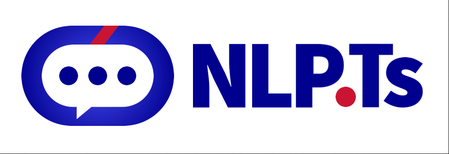
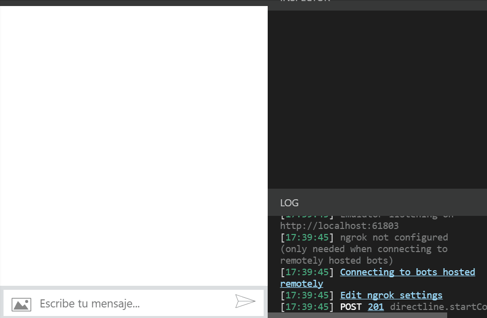

# NLP.ts
[](https://github.com/Leoglme/node-nlp-typescript/actions/workflows/main.yml)
[](https://www.npmjs.com/package/node-nlp-typescript)
[](https://www.npmjs.com/package/node-nlp-typescript)
[](https://www.npmjs.com/package/node-nlp-typescript)


node-nlp-typescript is a general natural language utility for nodejs. Currently supporting:

- Guess the language of a phrase
- Fast _Levenshtein_ distance of two strings
- Search the best substring of a string with less _Levenshtein_ distance to a given pattern.
- Get stemmers and tokenizers for several languages.
- Sentiment Analysis for phrases (with negation support).
- Named Entity Recognition and management, multi-language support, and acceptance of similar strings, so the introduced text does not need to be exact.
- Natural Language Processing Classifier, to classify an utterance into intents.
- NLP Manager: a tool able to manage several languages, the Named Entities for each language, the utterances, and intents for the training of the classifier, and for a given utterance return the entity extraction, the intent classification and the sentiment analysis. Also, it is able to maintain a Natural Language Generation Manager for the answers.
- 40 languages natively supported, 104 languages supported with BERT integration
- Any other language is supported through tokenization, even fantasy languages



### TABLE OF CONTENTS

<!--ts-->

- [Installation](#installation)
- [Example of use](#example-of-use)
- [False Positives](#false-positives)
- [Log Training Progress](#log-training-progress)
- [Contributors](#contributors)
- [Who is behind it](#who-is-behind-it-)
- [License](#license)
  <!--te-->

## Installation

If you're looking to use NLP.js in your Node application, you can install via NPM like so:

```bash
    npm install node-nlp-typescript
```

## Example of use

You can see a great example of use in the folder [`/examples/02-qna-classic`](https://github.com/axa-group/nlp.js/tree/master/examples/02-qna-classic). This example is able to train the bot and save the model to a file, so when the bot is started again, the model is loaded instead of being trained again.

You can start to build your NLP from scratch with a few lines:

```javascript
import { NlpManager } from 'node-nlp-typescript';

const manager = new NlpManager({ languages: ['en'], forceNER: true });
// Adds the utterances and intents for the NLP
manager.addDocument('en', 'goodbye for now', 'greetings.bye');
manager.addDocument('en', 'bye bye take care', 'greetings.bye');
manager.addDocument('en', 'okay see you later', 'greetings.bye');
manager.addDocument('en', 'bye for now', 'greetings.bye');
manager.addDocument('en', 'i must go', 'greetings.bye');
manager.addDocument('en', 'hello', 'greetings.hello');
manager.addDocument('en', 'hi', 'greetings.hello');
manager.addDocument('en', 'howdy', 'greetings.hello');

// Train also the NLG
manager.addAnswer('en', 'greetings.bye', 'Till next time');
manager.addAnswer('en', 'greetings.bye', 'see you soon!');
manager.addAnswer('en', 'greetings.hello', 'Hey there!');
manager.addAnswer('en', 'greetings.hello', 'Greetings!');

// Train and save the model.
(async() => {
    await manager.train();
    manager.save();
    const response = await manager.process('en', 'I should go now');
    console.log(response);
})();
```

This produces the following result in a console:

```bash
{ utterance: 'I should go now',
  locale: 'en',
  languageGuessed: false,
  localeIso2: 'en',
  language: 'English',
  domain: 'default',
  classifications:
   [ { label: 'greetings.bye', value: 0.698219120207268 },
     { label: 'None', value: 0.30178087979273216 },
     { label: 'greetings.hello', value: 0 } ],
  intent: 'greetings.bye',
  score: 0.698219120207268,
  entities:
   [ { start: 12,
       end: 14,
       len: 3,
       accuracy: 0.95,
       sourceText: 'now',
       utteranceText: 'now',
       entity: 'datetime',
       resolution: [Object] } ],
  sentiment:
   { score: 1,
     comparative: 0.25,
     vote: 'positive',
     numWords: 4,
     numHits: 2,
     type: 'senticon',
     language: 'en' },
  actions: [],
  srcAnswer: 'Till next time',
  answer: 'Till next time' }
```
## False Positives

By default, the neural network tries to avoid false positives. To achieve that, one of the internal processes is that words never seen by the network are represented as a feature that gives some weight to the `None` intent. So, if you try the previous example with "_I have to go_" it will return the `None` intent because 2 of the 4 words have never been seen while training.
If you don't want to avoid those false positives, and you feel more comfortable with classifications into the intents that you declare, then you can disable this behavior by setting the `useNoneFeature` to false:

```javascript
const manager = new NlpManager({ languages: ['en'], nlu: { useNoneFeature: false } });
```

## Log Training Progress

You can also add a log progress, so you can trace what is happening during the training.
You can log the progress to the console:

```javascript
const nlpManager = new NlpManager({ languages: ['en'], nlu: { log: true } });
```

Or you can provide your own log function:

```javascript
const logfn = (status, time) => console.log(status, time);
const nlpManager = new NlpManager({ languages: ['en'], nlu: { log: logfn } });
```

### Pour plus d'informations, vous pouvez consulter la documentation de [nlp.js](https://github.com/axa-group/nlp.js).

## Contributors

[](https://github.com/axa-group/nlp.js/graphs/contributors)

## Who is behind it`?`

This project is developed by AXA Group Operations Spain S.A.and leoglme.

If you need to contact us, you can do it at the email <a href="mailto:opensource@axa.com">opensource@axa.com</a>

## License

Copyright (c) AXA Group Operations Spain S.A and leoglme.

Permission is hereby granted, free of charge, to any person obtaining
a copy of this software and associated documentation files (the
"Software"), to deal in the Software without restriction, including
without limitation the rights to use, copy, modify, merge, publish,
distribute, sublicense, and/or sell copies of the Software, and to
permit persons to whom the Software is furnished to do so, subject to
the following conditions:

The above copyright notice and this permission notice shall be
included in all copies or substantial portions of the Software.

THE SOFTWARE IS PROVIDED "AS IS", WITHOUT WARRANTY OF ANY KIND,
EXPRESS OR IMPLIED, INCLUDING BUT NOT LIMITED TO THE WARRANTIES OF
MERCHANTABILITY, FITNESS FOR A PARTICULAR PURPOSE AND
NONINFRINGEMENT. IN NO EVENT SHALL THE AUTHORS OR COPYRIGHT HOLDERS BE
LIABLE FOR ANY CLAIM, DAMAGES OR OTHER LIABILITY, WHETHER IN AN ACTION
OF CONTRACT, TORT OR OTHERWISE, ARISING FROM, OUT OF OR IN CONNECTION
WITH THE SOFTWARE OR THE USE OR OTHER DEALINGS IN THE SOFTWARE.
